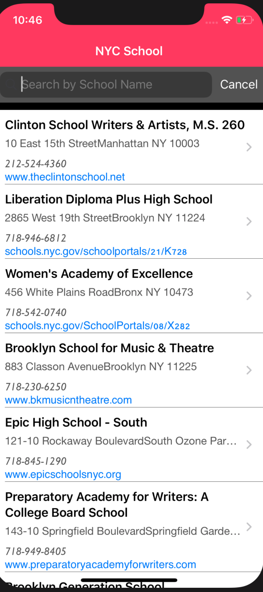
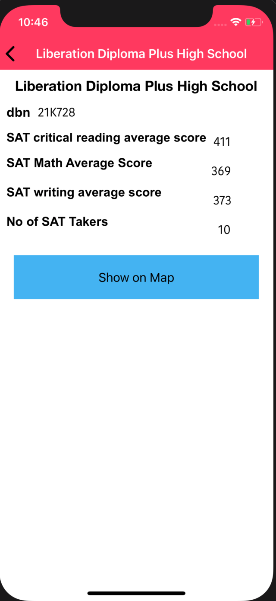
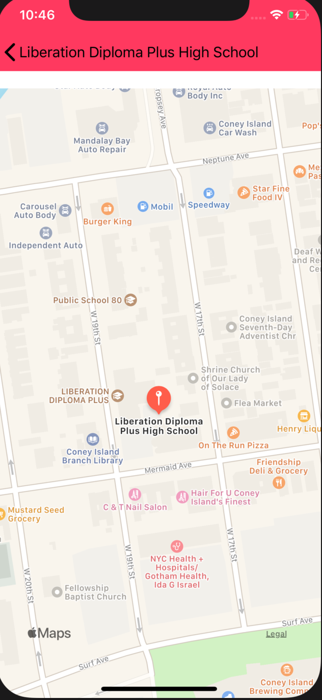

# 20210520-ArtiKarnik-NYCSchools

# NY School
 [NY School](#NYSchool)
    - [Table of Contents](#table-of-contents)
  * [Description](#description)
  * [Pre-requisite](#pre-requisite)
  * [Demo](#demo)
  * [Install](#install-)
  * [Contributor](#contributor)
  * [Codebase](#codebase)

## Description
 Create a native app to provide information on NYC High schools.
Display a list of NYC High Schools. 
Get your data here: https://data.cityofnewyork.us/Education/DOE-High-School-Directory-2017/s3k6-pzi2
Selecting a school should show additional information about the school 
Display all the SAT scores - include Math, Reading and Writing. 
SAT data here: https://data.cityofnewyork.us/Education/SAT-Results/f9bf-2cp4

## Pre-requisite
Install Xcode 

## Demo
  

## Install:
<strong>Code installation:</strong>  
$ cd [path_to_save_codebase]  
$ git clone https://github.com/arti-karnik/20210520-ArtiKarnik-NYCSchool 
Open Xcode project file, build and run

## Contributor
<strong> Github Profile: </strong>  
https://github.com/arti-karnik

<strong> Portfolio: </strong>  
https://arti-karnik.github.io/MyPortfolioPage/

## Codebase
https://github.com/arti-karnik/20210520-ArtiKarnik-NYCSchools

